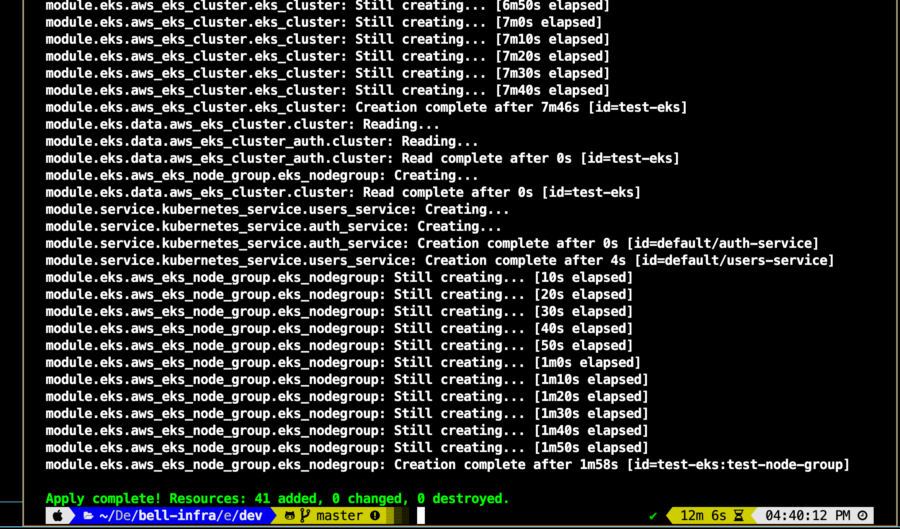

# 기획 단계

### 작업 사항
- [X] `kubernetes` 기반 인프라 환경 구현
- [X] api 서버 내부 통신 환경 구현
- [X] `Terraform` 인프라 설계 `CSP` 적용
- [X] `Helm chart` 기반 배포

</br>
</br>


# 인프라 환경
내부 통신만 진행하는 `Auth-api` 와, 실제 외부에 통신을 진행하는 `Users-api` 를 고려했을 때, 다음의 기술들이 필요하다고 판단했습니다.
- EKS : 쿠버네티스 환경 구성을 위해 필요한 서비스 입니다.
- Terraform : AWS 인프라에 대한 라이프사이클을 관리합니다.
- AWS VPC : 각 서버와 `DB` 의 업무에 따라, 작업 영역을 적절히 배치할 필요가 있어, 크게 `Public-subnet`, `Private-subnet1(server)` , `Private-subnet2(DB)`로 나누었습니다.
- ELB : 외부 요청을 수용하기 위한 `Kubernets service` 에 대한 인프라 구현을 위해 적용했습니다. 각 컨테이너는 부하에 따른 오토스케일링이 적용되어 있으므로, 각 서버 인스턴스에 대한, 부하 분산 작업을 처리합니다.
- IAM : `EKS` 에 대해, `VPC` 및 `WorkerNode` 에 대한 제어 권한을 설정하기 위해 반영했습니다.
- EC2 : `WorkerNode` 에 대한 인프라 환경을 구성하기 위해 해당 서비스를 적용했습니다.
- Helm : `back-end` 에 대한 배포 파이프라인을 구축하고자 적용했습니다. `Terraform` 프로젝트 내에서 `Chart` 정보를 읽어드려, 최신화된 컨테이너를 배포합니다.

</br>
</br>


# 인프라 구성도
본래 `DynamoDB` 를 활용하여, `Private-subnet2` 공간에 `DB` 를 배치하려 했으나, `MongoDB` 의 경우, 자체 무료 클러스터를 제공하여, 원격 요청에 대한 설정을 지정할 수 있다는 것을 파악했고, 인프라 환경에 외부에 배치하도록 적용했습니다.


# 소모 시간도

## environment
13~14분 정도 (eks: 8분, nodegroup: 2분, vpc: 2분)

## distribution(helm)
20초 이하 (back-end 만 가정)


# 프로젝트 구조

## `_variables_`
공통 변수 사항을 저장하는 공간입니다. 재사용성이 높은 변수들을 해당 폴더에 저장하고, 이를 불러오는 방식을 통해 가독성을 높였습니다. 

## modules
구성할 인프라 서비스를 정의하는 공간입니다. 해당 폴더에서는 `vpc` , `eks` , `service` 기능을 정의했습니다.

## environent
실제 정의한 인프라 정보를 기반으로 `CSP` 에 적용시키는 공간입니다.

## deployment
`Helm Chart` 정보를 기반으로 백엔드 어플리케이션 배포가 이루어지는 공간입니다.


```
📦 
├─ .gitignore
├─ _variables_
│  └─ dev
│     ├─ charts_info.yaml
│     ├─ common_info.yaml
│     ├─ common_tags.yaml
│     ├─ eks_cluster_info.yaml
│     ├─ service_info.yaml
│     └─ vpc_info.yaml
├─ deployment
│  └─ dev
│     ├─ charts
│     │  └─ api
│     │     ├─ Chart.yaml
│     │     ├─ templates
│     │     │  ├─ auth-api-deployment.yaml
│     │     │  └─ users-api-deployment.yaml
│     │     └─ values.yaml
│     └─ terraform
│        ├─ main.tf
│        └─ variables.tf
├─ environment
│  └─ dev
│     ├─ locals.tf
│     ├─ main.tf
│     ├─ provider.tf
│     └─ variables.tf
└─ modules
   ├─ eks
   │  ├─ cluster-role.tf
   │  ├─ cluster-sg.tf
   │  ├─ cluster.tf
   │  ├─ nodegroup-role.tf
   │  ├─ nodegroup-sg.tf
   │  ├─ nodegroup.tf
   │  ├─ outputs.tf
   │  └─ variables.tf
   ├─ service
   │  ├─ main.tf
   │  └─ variables.tf
   └─ vpc
      ├─ igw.tf
      ├─ nat.tf
      ├─ outputs.tf
      ├─ route.tf
      ├─ subnet.tf
      ├─ variables.tf
      └─ vpc.tf
```
